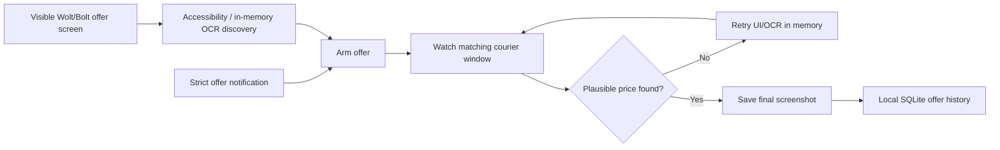

<p align="center">
  
</p>

<p align="center">
  <a href="https://github.com/Bl0ck154/CourierPilot/actions/workflows/ci.yml"></a>
  
  
  
  
</p>

> **Unofficial project.** CourierPilot is not affiliated with, endorsed by, or sponsored by Wolt, Bolt, or their affiliates. Product names and trademarks belong to their respective owners.

## Why CourierPilot?

Courier apps show useful offer and delivery information only briefly. CourierPilot creates a private local record of priced offers you actually saw, adds automatic online-time tracking, and maintains searchable local address/visit context for later deliveries.

Capture stays deliberately conservative: **an offer is not archived until a plausible non-zero price is visible.** Intermediate OCR probe screenshots remain in memory and are never written to the Gallery.

## CourierPilot 0.9.0

| Feature | Behavior |
|---|---|
| 💶 Offer price | Final screenshot/history row only after a plausible non-zero price is detected |
| 📍 Route | Distance, pickup/drop-off and €/km when the platform exposes enough data |
| 📦 Stacked offers | Multiple venues and multiple deliveries from one venue are supported |
| 🔔 Offer notifications | Only strict offer-like Wolt/Bolt notifications may arm or auto-open capture |
| 👀 Screen-only offers | Accessibility can discover an offer directly from a visible Wolt/Bolt screen; a notification is not required |
| 🟢 Online time | Automatic Wolt/Bolt presence tracking; no Start/End shift button |
| 🔑 Address memory | Searchable local address history, visit context and access/intercom codes |
| 🖼 Offer proof | Final priced screenshot saved under `Pictures/CourierOffers` |
| 🧭 Route research | Self-hosted Valhalla comparison with current GPS, address lookup, route preview and local verdict corpus |
| 🧪 Bolt map research | One-shot private Accessibility tree + screenshot + available cached GPS sample |

Fields the courier app does not expose remain empty rather than being invented.

## Capture has two entry paths

### 1. Strict notification path

`NotificationListenerService` only arms capture when the Wolt/Bolt notification looks like a real new offer. Routine courier notifications such as completion/payment/message updates do not trigger auto-open.

### 2. Visible-screen path

If the courier app is already open and an offer appears directly on screen, `AccessibilityService` inspects the active Wolt/Bolt window. When the Accessibility tree is insufficient, CourierPilot can make a rate-limited **in-memory** screenshot and run on-device ML Kit OCR to recognize the offer.

This means the app no longer depends on the chain `notification → pending offer → screenshot` for every capture.



## Automatic online/offline tracking

CourierPilot combines two kinds of evidence:

- a persistent/ongoing Wolt or Bolt notification can be positive evidence that the platform is online;
- explicit online/offline wording on a courier notification can update the state;
- the visible courier screen is treated as a stronger online/offline signal.

A notification disappearing is **not** treated as proof of offline. It becomes an `Unknown` notification signal because the user may have swiped it away, Android may have removed it, or a courier app may have stale notification behavior. A recent strong on-screen offline signal also temporarily overrides a stale persistent notification.

The dashboard shows Wolt and Bolt separately as `Online`, `Offline`, or `Unknown`, together with automatically tracked online time.

## Local address memory

While a courier delivery screen is visible, CourierPilot can recognize address/instruction text and retain useful local address/visit context. It also extracts explicit access-code patterns such as door/intercom/gate codes.

The separate local `courier_meta.db` stores the searchable address record and visit history, including:

- normalized address and detected customer/delivery context;
- access/intercom code when explicitly exposed;
- source platform and nearby delivery details;
- first/last seen time and visit history.

Apartment suffixes are removed from the building key where possible (for example `Žirmūnų g. 23-45` can match the building `Žirmūnų g. 23`). The **Addresses** tab supports local search and opens retained addresses in maps.

Address memory and offer history can contain customer/delivery context and raw Accessibility/OCR text from captured screens. They stay local but must be treated as private; none of this content is copied into the privacy-safe Reliability event log.

## Dashboard

The main UI is Jetpack Compose + Material 3 with system dark mode and Android safe-area handling. The four primary tabs are:

- **Home** — Wolt/Bolt presence, automatic tracked time, today metrics and recent offers;
- **History** — recent priced offer records;
- **Addresses** — searchable local address/visit/access-code memory;
- **Stats** — offer statistics plus automatically detected online time.

The old manual-shift activity is only a compatibility redirect into the dashboard; it no longer exposes manual shift controls.

## Offer Details and statistics

Captured offers can contain platform/time, full-delivery price, route distance, €/km, estimated time, merchant/pickup information, customer/drop-off information, delivery count, original screenshot and optional raw Accessibility/OCR text for local diagnostics.

CourierPilot reports offer data rather than pretending an offer was completed or paid. Missing Bolt/Wolt fields remain empty.

## Reliability Center

Android/OEM background restrictions can interrupt Notification Listener or Accessibility services. The Reliability screen includes permission/service state, Doze/background restriction information, optional strict offer auto-open, optional brief wake-screen behavior, optional non-persistent alive reminder, pending capture state, last screenshot/error, bounded event diagnostics and Android-settings shortcuts.

## Route intelligence research

Reliability links to a protected Valhalla research screen backed by the self-hosted Lithuania/Vilnius routing service.

The test workflow now supports:

- **Use my current location** for a one-shot foreground start fix;
- Android address lookup for a destination, with coordinates still visible/editable;
- side-by-side pedestrian-shortcut and cycleway-biased Valhalla candidates;
- distance, generic ETA and warnings;
- a lightweight native geometry preview: orange pedestrian, blue cycleway;
- shareable GeoJSON for a suspicious comparison;
- local verdicts (`pedestrian better`, `cycleway better`, `both usable`, `both bad`) plus notes in a separate `route_research.db`.

The route preview deliberately does not claim to be a navigation map. The goal of 0.9 is to collect a real Vilnius validation corpus before automatic offer-time routing is enabled.

See [`docs/ROUTE_RESEARCH_TESTING.md`](docs/ROUTE_RESEARCH_TESTING.md) for the exact phone workflow.

## Bolt map research

Bolt may show useful pickup/drop-off geometry on a map without exposing a reliable text address. CourierPilot therefore has a separate research-only Accessibility service.

After one explicit **Arm next Bolt offer/map screen** action, the service consumes the arm once and can store a private bundle containing:

- bounded Accessibility hierarchy with screen bounds;
- a screenshot of that Bolt research frame when Android permits it;
- timestamp and screen dimensions;
- the best cached phone location with accuracy/age/provider when location permission was previously granted.

The sample is not added to normal diagnostics. It can be deliberately shared through a restricted `FileProvider` or deleted from the research screen. It may contain customer/location information and should not be posted publicly.

## Future route intelligence scaffolding

0.9 also keeps non-production models for the next phases:

- offer → resolved/unresolved route waypoints with coordinate provenance;
- Bolt screen-pixel → geographic transform that refuses to guess missing map scale/orientation;
- delivery lifecycle observations;
- transparent route-based €/km and effective €/h calculations;
- GPS trace and conservative personal segment/restaurant-wait statistics;
- Valhalla `/trace_attributes` contract for future map matching.

These models are intentionally not wired into automatic courier decisions yet.

## Privacy model

CourierPilot is a local personal tool:

- offer history and automatic-work/address metadata are stored in local SQLite databases;
- route-validation data is stored separately in `route_research.db`;
- final priced offer screenshots are stored in `Pictures/CourierOffers`;
- intermediate OCR discovery screenshots remain in memory and are recycled;
- customer names/exact addresses are not added to the privacy-safe Reliability event log;
- `INTERNET` is used by explicitly enabled self-hosted route research; Android cleartext traffic is disabled;
- foreground coarse/fine location is optional for the research screen; there is no background-location permission in 0.9;
- the Valhalla URL/token are stored in app-private no-backup storage and excluded from diagnostics;
- Bolt research bundles remain app-private until deliberately shared;
- there is no CourierPilot account or cloud sync.

Raw offer-screen Accessibility/OCR text and Bolt research samples can contain personal delivery information and should be treated as private.

## Installation

1. Install a release-signed CourierPilot APK.
2. Enable **Notification access** for CourierPilot.
3. Enable **Accessibility → CourierPilot screen capture**.
4. Review **Settings / Reliability** if the phone aggressively restricts background services.

Optional route research is configured separately under **Reliability → Open route comparison**. Do not paste the bearer token into GitHub issues or public diagnostics.

For Bolt map research, separately enable **Accessibility → CourierPilot Bolt diagnostics** only when collecting samples.

## Requirements

- Android 11 / API 30 or newer;
- Wolt Courier Partner and/or Bolt Courier installed;
- Notification Access permission for notification classification/presence signals;
- Accessibility service enabled for screen capture, screen-only offers and stronger screen-state observation;
- optional foreground location permission for route research.

## Tech stack

- Kotlin / Android SDK 35 / Java 17;
- Jetpack Compose + Material 3;
- `NotificationListenerService`;
- `AccessibilityService`;
- Google Play services ML Kit Text Recognition;
- HTTPS-only self-hosted Valhalla research client;
- Android `Geocoder` + foreground `LocationManager` research helpers;
- `SQLiteOpenHelper` for offer history, local metadata and isolated route research;
- JUnit + Robolectric;
- GitHub Actions for CI and permanent-certificate release builds.

## Build from source

```bash
gradle testDebugUnitTest assembleDebug
```

Release tasks require all permanent signing variables:

```text
ANDROID_KEYSTORE_PATH
ANDROID_KEYSTORE_PASSWORD
ANDROID_KEY_ALIAS
ANDROID_KEY_PASSWORD
```

The private keystore is not stored in the repository. See [`docs/RELEASE_SIGNING.md`](docs/RELEASE_SIGNING.md).

## Current release

**CourierPilot 0.9.0** (`versionCode 15`)

0.9 turns the protected Valhalla hook into a real-device research workflow: current phone location, destination geocoding, route geometry comparison, local route verdicts and complete one-shot Bolt map samples. Production offer capture remains independent from routing and preserves the priced-screenshot rule.

## Known limitations

- Wolt/Bolt notification wording and UI can change, so strict offer/presence phrases may need real-device tuning.
- Notification disappearance deliberately produces an uncertain signal instead of guessing offline.
- If a courier platform exposes neither recognizable Accessibility text nor OCR-recognizable offer controls, a screen-only offer can still be missed.
- Android/OEM background restrictions can interrupt capture until system access/settings are corrected.
- A courier app can block screenshots using secure-window flags.
- Address/access-code extraction and Android address geocoding are best-effort; verify results before relying on them.
- Capture is still serialized around one active offer, with limited queuing/replacement behavior for overlapping Wolt/Bolt offers.
- CourierPilot records offers shown, not whether an offer was accepted, completed, cancelled, or paid.
- Valhalla candidates remain experimental until enough real Vilnius routes are reviewed; generic ETA is not a personalized scooter estimate.
- The 0.9 route preview shows route geometry without a basemap.
- Production automatic offer-time routing and continuous personal GPS learning remain disabled.

## Contributing

Real Wolt/Bolt parser samples are useful when app UI or notification wording changes. Redact customer names, phone numbers, exact addresses and screenshots before posting public bug reports. Prefer the Reliability screen's privacy-safe diagnostics when possible.

See [`CONTRIBUTING.md`](CONTRIBUTING.md).

---

<p align="center">
  Built for real-world courier use — local data, inspectable behavior, and no invented metrics.
</p>
