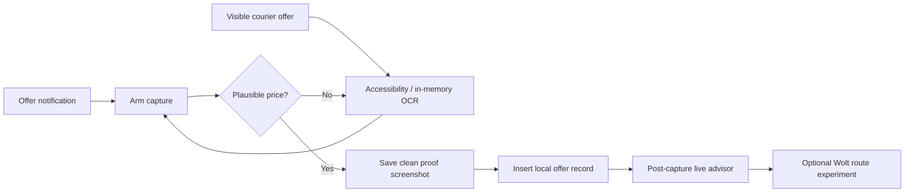

<p align="center">
  
</p>

<p align="center">
  <a href="https://github.com/Bl0ck154/CourierPilot/actions/workflows/ci.yml"></a>
  
  
  
  
</p>

> **Unofficial project.** CourierPilot is not affiliated with, endorsed by, or sponsored by Wolt, Bolt, or their affiliates. Product names and trademarks belong to their respective owners.

## What CourierPilot does

CourierPilot is a local-first Android companion for courier work. It captures priced Wolt/Bolt offers that are actually shown on the phone, keeps searchable local history, tracks platform presence, remembers useful delivery-address context, and now provides a transparent post-capture live advisor.

The capture rule remains strict: **the original offer is not archived until a plausible non-zero price is visible.** The final proof screenshot is saved before CourierPilot draws its own advisor overlay or starts any route request.

## CourierPilot 0.10.0

| Feature | Behavior |
|---|---|
| 💶 Priced offer history | Saves a final screenshot and local record only after a plausible price is detected |
| 👀 Screen-only capture | Accessibility + bounded on-device OCR can discover offers even without a useful notification |
| 📦 Stacked offers | Keeps multiple merchants, pickups, customers and drop-offs; sequential Timeline stop order is preserved for routing |
| 📊 Live advisor | Post-capture card shows price, platform km/ETA, €/km and platform-derived €/h range |
| 🧭 Wolt route experiment | Optional `current GPS → Wolt Timeline stops` geocoding + self-hosted Valhalla comparison |
| 🟠🔵 Route provenance | Shows pedestrian-shortcut and cycleway-biased candidates separately; CourierPilot does not select a winner |
| 🔊 Voice | Optional short spoken offer summary, off by default |
| 🧪 Bolt route research | One-shot private Accessibility tree + screenshot + cached GPS bundle for real marker-coordinate research |
| 🧾 Outcome groundwork | Records `OFFER_CAPTURED` and only explicit monotonic courier-screen lifecycle cues |
| 🟢 Platform presence | Automatic Wolt/Bolt Online / Offline / Unknown tracking |
| 🔑 Address memory | Searchable local visits, delivery context and explicit access/intercom codes |

Fields that the courier app does not expose remain empty rather than being invented.

## Capture pipeline

CourierPilot has two offer entry paths:

1. a strict Wolt/Bolt offer-like notification can arm capture;
2. an already-visible courier screen can be recognized through Accessibility, with on-device ML Kit OCR as a bounded fallback.



The `screenshot → offer DB insert` boundary is deliberately before advisor/routing work. A geocoder, GPS or Valhalla failure cannot roll back a successfully captured offer.

## Live advisor

After the clean proof screenshot and offer row have been saved, CourierPilot can draw a temporary `TYPE_ACCESSIBILITY_OVERLAY` card over the courier app.

The card reports only inspectable numbers, for example:

```text
Wolt · €6.40 · 4.0 km · 20–30 min
€1.60/km · €12.8–19.2/h · platform data

Calculated route · 3 points
🟠 pedestrian: 4.72 km · generic 56.0 min
🔵 cycleway: 5.01 km · generic 18.4 min
No route winner selected
```

The first €/h range is simple arithmetic from the **platform-provided ETA**, not a claim about actual completion earnings. Generic Valhalla durations are labeled as generic and are not treated as personalized scooter ETA.

The card includes persistent toggles for:

- **Wolt route ON/OFF** — off by default and independent from normal capture;
- **Voice ON/OFF** — off by default.

CourierPilot never presses Accept/Decline and does not convert these numbers into a hidden GOOD/BAD verdict.

## Experimental Wolt route intelligence

When the user explicitly turns **Wolt route ON** and the protected Valhalla endpoint is configured, CourierPilot can run route research automatically **after** the offer was archived.

For a Wolt offer it:

1. requests one fresh foreground device-location fix;
2. reparses the same captured offer text and preserves the Wolt Timeline stop order;
3. geocodes every textual pickup/drop-off address;
4. fails closed if any required stop cannot be resolved;
5. sends the ordered coordinates to the self-hosted Valhalla endpoint;
6. requests both pedestrian-shortcut and cycleway-biased candidates;
7. shows both results instead of silently selecting one;
8. stores the run, waypoint order, coordinate provenance/confidence and candidate summary in `route_research.db`.

Platform km/ETA and calculated route km/time remain separate data sources.

Automatic Wolt routing is intentionally an opt-in because offer-time current/pickup/drop-off coordinates are sent from the phone to the configured self-hosted Valhalla server. There is still no background-location permission or continuous GPS tracking in 0.10.

## Delivery outcome groundwork

CourierPilot now associates a captured offer ID with an isolated delivery timeline, but the detector is intentionally conservative.

`OFFER_CAPTURED` is certain because it is written only after the priced offer is durably stored. Later events are accepted only when the courier UI exposes explicit text and the state transition is plausible:

```text
OFFER_CAPTURED
  → ACCEPTED
  → ARRIVED_PICKUP
  → PICKED_UP
  → ARRIVED_DROPOFF
  → DELIVERED
```

`CANCELLED` can terminate an active route from the permitted in-progress states. A disappearing offer, changed screen or generic address view is **not** treated as proof of acceptance or completion.

This is groundwork for future real restaurant-wait and completion-time statistics; it is not yet a promise that every Wolt/Bolt delivery lifecycle will be recognized.

## Bolt map research

Bolt remains the harder route source because a real offer can contain useful map markers without reliable textual destination coordinates.

CourierPilot therefore keeps a separate research-only Accessibility service. After one explicit **Arm next Bolt offer/map screen** action it can store a private bundle containing:

- bounded Accessibility hierarchy and node bounds;
- a screenshot of that Bolt frame when Android permits it;
- timestamp and screen dimensions;
- best available cached phone location, accuracy, age and provider.

The bundle stays app-private until deliberately shared and may contain customer/location information. CourierPilot does not fabricate Bolt coordinates when map scale/orientation evidence is missing.

See [`docs/ROUTE_RESEARCH_TESTING.md`](docs/ROUTE_RESEARCH_TESTING.md) and [`docs/BOLT_MAP_COORDINATE_RECOVERY.md`](docs/BOLT_MAP_COORDINATE_RECOVERY.md).

## Manual route research

**Reliability → Open route comparison** remains available for controlled Vilnius tests. It supports:

- one-shot current phone location;
- address → coordinates lookup;
- pedestrian-shortcut vs cycleway-biased Valhalla candidates;
- native geometry preview;
- GeoJSON sharing;
- local verdicts (`pedestrian better`, `cycleway better`, `both usable`, `both bad`) and notes.

The validation corpus is still important: 0.10 intentionally does not promote one stock Valhalla profile as the universal scooter route.

## Local address memory and statistics

CourierPilot stores offer history in `courier_offers.db` and delivery/address context in `courier_meta.db`. The Addresses tab can search retained buildings/visits and remembers explicit access/intercom/gate codes when exposed by the courier UI.

The dashboard keeps four main tabs:

- **Home** — Wolt/Bolt presence, automatic tracked time, today metrics and recent offers;
- **History** — priced offer records;
- **Addresses** — searchable local address/visit/access-code memory;
- **Stats** — offer statistics and automatically detected online time.

CourierPilot still distinguishes **offers shown** from actual money earned. Offer history does not magically become payout history.

## Privacy model

CourierPilot is local-first:

- offer history, outcome evidence and address metadata stay in local SQLite databases;
- route-validation/advisor provenance stays in separate `route_research.db`;
- final priced offer screenshots are stored under `Pictures/CourierOffers`;
- intermediate OCR screenshots stay in memory and are recycled;
- normal Reliability diagnostics exclude customer names, exact addresses and raw offer text;
- Android cleartext traffic is disabled;
- Valhalla URL/token are kept in app-private no-backup storage and excluded from diagnostics;
- automatic Wolt routing is off by default;
- when that route toggle is enabled, ordered offer coordinates are sent only to the configured self-hosted Valhalla endpoint;
- there is no background-location permission, CourierPilot account or cloud sync.

Raw offer text, exact addresses, GPS data and Bolt research bundles are sensitive local data.

## Installation

1. Install a release-signed CourierPilot APK.
2. Enable **Notification access** for CourierPilot.
3. Enable **Accessibility → CourierPilot screen capture**.
4. Grant foreground location only if you want route research/Wolt routing.
5. Review **Reliability** if Android/OEM battery controls interrupt capture.

For Bolt map research, separately enable **Accessibility → CourierPilot Bolt diagnostics** only when collecting a sample.

## Requirements and stack

- Android 11 / API 30+;
- Kotlin / Android SDK 35 / Java 17;
- Jetpack Compose + Material 3;
- NotificationListenerService + AccessibilityService;
- Google Play services ML Kit Text Recognition;
- Android `LocationManager` + `Geocoder` for foreground route experiments;
- protected HTTPS self-hosted Valhalla client;
- SQLiteOpenHelper;
- JUnit + Robolectric;
- GitHub Actions CI and permanent-certificate signed release builds.

## Build from source

```bash
gradle testDebugUnitTest assembleDebug
```

Release tasks require the permanent signing environment documented in [`docs/RELEASE_SIGNING.md`](docs/RELEASE_SIGNING.md).

## Current release

**CourierPilot 0.10.0** (`versionCode 16`)

0.10 moves route intelligence out of a purely manual harness: platform economics are available in a post-capture live card, and an explicitly enabled Wolt experiment can resolve the actual captured Timeline into two self-hosted Valhalla candidates. Core offer capture remains independent and fail-safe.

## Known limitations

- Courier-app UI/notification wording can change and may require parser/lifecycle tuning.
- Android/OEM background restrictions can interrupt Notification Listener or Accessibility services.
- A courier app can block screenshots using secure-window flags.
- Android address geocoding is best-effort; one unresolved Wolt stop intentionally cancels that calculated route run.
- Generic Valhalla ETA is not yet a personalized Ninebot/scooter ETA.
- Real Vilnius route validation is still required before selecting or tuning a preferred routing profile.
- Bolt automatic routing is blocked on trustworthy recovery of real offer marker coordinates; collect real Bolt samples instead of guessing.
- Explicit lifecycle tracking is intentionally incomplete when the courier UI never exposes a recognized state cue.
- Continuous GPS trace collection, map matching, learned segment speeds and restaurant-wait prediction remain later opt-in work.

## Contributing

Real parser/route samples are useful when platform UI changes. Redact customer names, phone numbers, exact addresses and screenshots before posting public issues. Private Bolt research bundles should not be attached to public GitHub issues.

See [`CONTRIBUTING.md`](CONTRIBUTING.md).

---

<p align="center">
  Built for real courier use: inspectable numbers, explicit provenance, local data, no invented certainty.
</p>
