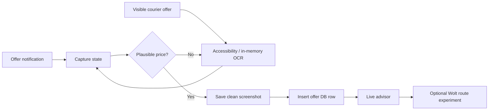

<p align="center">
  
</p>

<p align="center">
  <a href="https://github.com/Bl0ck154/CourierPilot/actions/workflows/ci.yml"></a>
  
  
  
  
</p>

> **Unofficial project.** CourierPilot is not affiliated with, endorsed by, or sponsored by Wolt, Bolt, or their affiliates.

## What it is

CourierPilot is a local-first Android companion for Wolt/Bolt courier work. It archives priced offers actually shown on the phone, keeps searchable local history/address context, tracks platform presence, and provides a transparent post-capture live advisor.

**The clean offer is always captured first.** CourierPilot saves the final proof screenshot and inserts the offer row before drawing its own advisor UI or starting GPS/geocoding/Valhalla work.

## 0.10.0 highlights

| Feature | Behavior |
|---|---|
| 💶 Offer history | Saves only after a plausible non-zero price is visible |
| 👀 Screen-only capture | Accessibility + bounded on-device OCR can recognize offers without a useful notification |
| 📦 Stacked routes | Multiple merchants/customers plus the sequential Wolt Timeline stop order are retained |
| 📊 Live advisor | Price, platform km/ETA, €/km and platform-ETA-derived €/h range |
| 🧭 Wolt route experiment | Explicit opt-in `fresh GPS → captured Timeline stops → geocode → Valhalla` |
| 🟠🔵 Route candidates | Pedestrian-shortcut and cycleway-biased results stay separate; no automatic winner |
| 🔊 Voice | Optional short spoken summary, off by default |
| 🧪 Bolt research | Private one-shot Accessibility tree + screenshot + cached GPS bundle |
| 🧾 Outcome groundwork | Certain `OFFER_CAPTURED` + only explicit monotonic delivery-state cues |
| 🔑 Address memory | Searchable visits/context and explicit access/intercom codes |

Missing platform fields remain missing instead of being invented.

## Capture → advisor pipeline



Advisor/router exceptions are best-effort post-capture work and cannot roll back an archived offer.

## Live advisor

The temporary Accessibility overlay reports inspectable arithmetic rather than a hidden rating:

```text
Wolt · €6.40 · 4.0 km · 20–30 min
€1.60/km · €12.8–19.2/h · platform data

Calculated route · 3 points
🟠 pedestrian: 4.72 km · generic 56.0 min
🔵 cycleway: 5.01 km · generic 18.4 min
No route winner selected
```

The first €/h range is calculated only from the **platform-provided ETA**. Generic Valhalla duration is labeled generic and is not presented as personalized scooter ETA.

The card has persistent controls:

- **Wolt route ON/OFF** — off by default;
- **Voice ON/OFF** — off by default.

CourierPilot never presses Accept/Decline and does not convert these metrics into an automatic GOOD/BAD verdict.

## Experimental Wolt routing

With **Wolt route ON**, foreground location permission granted, and the protected endpoint configured, CourierPilot runs after the offer has already been stored:

1. obtain one bounded fresh phone-location fix;
2. reparse the captured Wolt text;
3. preserve the exact parsed Timeline stop order, including interleaved stacked stops;
4. resolve each textual stop through the device's Android `Geocoder` implementation with a bounded per-stop deadline;
5. fail the calculated run if any required stop is unresolved;
6. send the resolved ordered coordinates to the configured self-hosted Valhalla endpoint;
7. request both pedestrian-shortcut and cycleway-biased candidates;
8. store run/waypoint/candidate provenance locally in `route_research.db`.

Platform km/ETA and calculated km/time never overwrite each other.

## Outcome groundwork

A persisted offer creates a certain `OFFER_CAPTURED` event. Later events are accepted only from explicit courier-screen wording and only when the transition is monotonic:

```text
OFFER_CAPTURED → ACCEPTED → ARRIVED_PICKUP → PICKED_UP → ARRIVED_DROPOFF → DELIVERED
```

`CANCELLED` can terminate permitted in-progress states. Screen disappearance or a generic later delivery screen is not treated as proof of acceptance/completion. This intentionally misses uncertain cases rather than attaching the wrong outcome to an offer.

## Bolt route research

Bolt can expose useful marker geometry without a reliable textual destination. CourierPilot therefore keeps a separate, explicitly armed research Accessibility service that can capture:

- bounded Accessibility hierarchy and node bounds;
- matching screenshot when Android permits it;
- timestamp/screen dimensions;
- best cached phone GPS fix with age/accuracy/provider.

The bundle stays private until deliberately shared. CourierPilot does not fabricate Bolt coordinates when map scale/orientation evidence is missing.

See [`docs/BOLT_MAP_COORDINATE_RECOVERY.md`](docs/BOLT_MAP_COORDINATE_RECOVERY.md) and [`docs/ROUTE_RESEARCH_TESTING.md`](docs/ROUTE_RESEARCH_TESTING.md).

## Manual route validation

**Reliability → Open route comparison** remains the controlled Vilnius harness for:

- current phone fix;
- address lookup / editable coordinates;
- pedestrian vs cycleway Valhalla comparison;
- geometry preview and GeoJSON export;
- local verdicts/notes.

The real validation corpus is still required before CourierPilot promotes/tunes a preferred scooter profile.

## Local data

- `courier_offers.db` — priced offer history;
- `courier_meta.db` — platform presence, address visits/context and access-code memory;
- `route_research.db` — route validation, live-route provenance and conservative lifecycle research;
- `Pictures/CourierOffers` — final priced proof screenshots.

Normal Reliability diagnostics intentionally exclude customer names, exact addresses and raw offer text.

## Privacy

CourierPilot is local-first, but route intelligence has explicit network boundaries:

- automatic Wolt routing is **off by default**;
- textual Wolt stops are passed to the device's Android `Geocoder` implementation, whose underlying service is determined by the device/OS;
- resulting ordered coordinates are sent to the configured protected self-hosted Valhalla server;
- the Valhalla URL/token stay in app-private no-backup storage and are excluded from diagnostics;
- Bolt research bundles remain private until deliberately exported;
- there is no background-location permission, CourierPilot account or cloud sync in 0.10.

Raw offer text, exact addresses, GPS points and Bolt samples are sensitive data.

## Installation

1. Install a release-signed CourierPilot APK.
2. Enable **Notification access**.
3. Enable **Accessibility → CourierPilot screen capture**.
4. Grant foreground location only for route research/Wolt routing.
5. Review **Reliability** if Android/OEM battery controls interrupt capture.

Enable **CourierPilot Bolt diagnostics** separately only when collecting Bolt research samples.

## Stack

Android 11+ · Kotlin · Android SDK 35 · Java 17 · Jetpack Compose / Material 3 · NotificationListenerService · AccessibilityService · ML Kit Text Recognition · Android LocationManager/Geocoder · protected self-hosted Valhalla · SQLiteOpenHelper · JUnit/Robolectric · GitHub Actions.

## Build

```bash
gradle testDebugUnitTest assembleDebug
```

Release signing is documented in [`docs/RELEASE_SIGNING.md`](docs/RELEASE_SIGNING.md).

## Current release

**CourierPilot 0.10.0** (`versionCode 16`)

0.10 moves Wolt route intelligence into an explicit post-capture experiment while preserving the clean offer-capture boundary. See [`docs/RELEASE_0.10.0.md`](docs/RELEASE_0.10.0.md) and [`docs/ROUTE_INTELLIGENCE_IMPLEMENTATION_STATUS.md`](docs/ROUTE_INTELLIGENCE_IMPLEMENTATION_STATUS.md).

## Known limitations / next work

- real Wolt Timeline/geocoding/route behavior still needs phone validation, especially stacked jobs;
- generic Valhalla ETA is not a personalized Ninebot ETA;
- Bolt automatic routing waits for trustworthy marker recovery from real samples;
- explicit lifecycle cue coverage is intentionally incomplete;
- continuous active-work GPS, map matching, learned segment speed and venue-wait prediction are later opt-in phases;
- if stock Valhalla profiles remain poor on real Vilnius routes, the next routing step is server-side profile/costing work rather than opaque client heuristics.

See [`docs/ROUTE_INTELLIGENCE_ROADMAP.md`](docs/ROUTE_INTELLIGENCE_ROADMAP.md).

---

<p align="center">Built for real courier use: inspectable numbers, explicit provenance, no invented certainty.</p>
