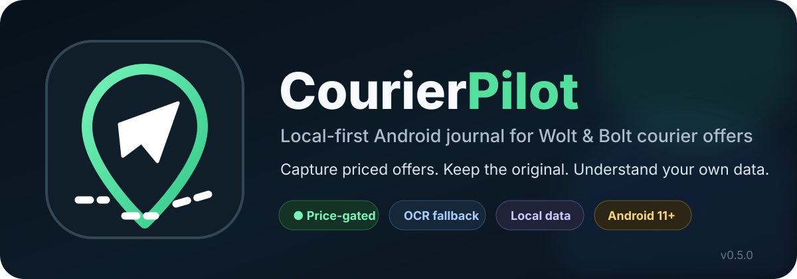
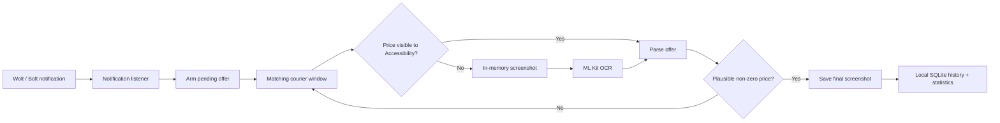

<p align="center">
  
</p>

<p align="center">
  <a href="https://github.com/Bl0ck154/CourierPilot/actions/workflows/build.yml"></a>
  
  
  
  
</p>

> **Unofficial project.** CourierPilot is not affiliated with, endorsed by, or sponsored by Wolt, Bolt, DoorDash, or any of their affiliates. Product names and trademarks belong to their respective owners.

## Why CourierPilot?

Courier apps show a lot of useful information at offer time, but that information is temporary. CourierPilot creates a private, searchable record of the offers **you actually saw** so you can review patterns later instead of relying on memory.

It is deliberately conservative about capture: **an offer is not archived until a plausible non-zero price is visible.** Intermediate OCR screenshots stay in memory and are not written to the Gallery.

### What it can record

| | CourierPilot 0.5.0 |
|---|---|
| 💶 Price | Captured only when a real non-zero price is detected |
| 📍 Distance | Stored when the courier app exposes it |
| ⏱ Estimated time | Stored when available |
| 🏪 Merchant | Best-effort merchant/venue extraction |
| 🧭 Pickup / drop-off | Structured locally when available |
| 👤 Customer name | Stored locally when available |
| 📦 Stacked offers | Delivery count and multi-stop details supported |
| 🖼 Original offer | Final priced screenshot saved to `Pictures/CourierOffers` |
| 🕒 Work time | Manual `Start shift` / `End shift` tracking |

Fields that a courier platform does not expose are left empty rather than invented.

## Highlights

### Automatic priced-offer capture

`NotificationListenerService` detects new Wolt/Bolt tasks and arms a capture transaction. `AccessibilityService` watches the matching courier window and parses visible UI text. If the price is not exposed through Accessibility, CourierPilot uses on-device ML Kit OCR as a fallback.

The active transaction is protected from repeated notification updates and stale OCR callbacks, and can stay pending for up to three minutes while waiting for a price.

### Offer Details

Each captured offer can include:

- platform and arrival time;
- expected price;
- route distance and calculated €/km when distance exists;
- estimated time;
- single vs stacked delivery count;
- merchant names and pickup addresses;
- customer names and drop-off addresses;
- original screenshot;
- optional raw Accessibility/OCR text for parser diagnostics.

### Statistics that describe offers — not imaginary earnings

CourierPilot can show:

- Today / 7-day / 30-day offer summaries;
- Wolt vs Bolt split;
- average offer value;
- average detected distance;
- average €/km where distance exists;
- single vs stacked counts;
- represented delivery stops;
- top detected venues;
- hourly offer-arrival activity;
- interactive 365-day contribution-style heatmap;
- manually tracked work time.

`Offers / tracked hour` is intentionally an **offer-arrival metric**, not completed-delivery earnings per hour.

### Reliability Center

Android background behavior can be aggressive, especially on OEM builds. CourierPilot includes a dedicated Reliability screen with:

- Notification Listener status;
- Accessibility capture status;
- battery-optimization / Doze state;
- Android background restriction state;
- current pending offer;
- last screenshot / last error;
- privacy-safe bounded capture event log;
- shortcuts to the relevant Android settings;
- shareable privacy-safe diagnostics.

Pending capture can resume on device unlock. An optional **Wake screen for offers** setting briefly wakes the display without unlocking or bypassing the keyguard.

## How capture works



No Wolt/Bolt APK modification is involved. CourierPilot does **not** require root, Shizuku, ADB, Lucky Patcher, or a MediaProjection permission prompt.

## Privacy model

CourierPilot is designed as a local personal tool.

- Offer history is stored in the app's local SQLite database.
- Final offer screenshots are stored in the user's Gallery under `Pictures/CourierOffers`.
- Customer names and addresses are not written to the privacy-safe reliability event log.
- Intermediate OCR probe screenshots are kept in memory only and recycled after recognition.
- The app manifest does **not** request Android's `INTERNET` permission.
- There is no CourierPilot account or cloud sync.

Raw Accessibility/OCR text can contain information visible on the courier screen, so it is kept for local diagnostics and should be treated as private data.

## Installation

CourierPilot currently targets personal/sideloaded Android use.

1. Install a signed CourierPilot APK.
2. Open **CourierPilot**.
3. Enable **Notification access** for CourierPilot.
4. Enable **Accessibility → CourierPilot screen capture**.
5. On phones with aggressive background management, review the **Reliability** screen and allow the app to keep running as needed.

Optional settings include automatic opening of the relevant courier app after a matching notification and briefly waking the screen for pending offers.

> GitHub Releases have not been published yet. Signed release builds are produced by the repository's GitHub Actions workflow and use the permanent CourierPilot signing identity documented in [`docs/RELEASE_SIGNING.md`](docs/RELEASE_SIGNING.md).

## Requirements

- Android 11 / API 30 or newer;
- Wolt Courier Partner and/or Bolt Courier app installed;
- Notification Access permission;
- Accessibility service enabled for offer capture.

## Tech stack

- **Kotlin** / native Android framework;
- **NotificationListenerService** for incoming courier-task notifications;
- **AccessibilityService** for window-aware UI extraction and screenshot capture;
- **Google Play services ML Kit Text Recognition** for OCR fallback;
- **SQLiteOpenHelper** for local offer and shift history;
- **JUnit** parser regression tests;
- **GitHub Actions** for signed release builds and certificate verification.

The project intentionally stays small: no Compose, no Room, no account backend and no cloud database.

## Build from source

The project uses Java 17 and Android SDK 35.

```bash
gradle testDebugUnitTest
```

Release tasks intentionally fail unless all signing environment variables are present:

```text
ANDROID_KEYSTORE_PATH
ANDROID_KEYSTORE_PASSWORD
ANDROID_KEY_ALIAS
ANDROID_KEY_PASSWORD
```

The repository does not contain the private release keystore. See [`docs/RELEASE_SIGNING.md`](docs/RELEASE_SIGNING.md) for the public signing identity and verification process.

## Current release

**CourierPilot 0.5.0** (`versionCode 5`)

0.5.0 adds the Reliability Center, privacy-safe event logging, unlock recovery, optional screen wake, rich offer details, stacked-delivery statistics, venue statistics, manual shift tracking and parser regression coverage based on real Wolt/Bolt offer layouts.

Full notes: [`docs/RELEASE_0.5.0.md`](docs/RELEASE_0.5.0.md)

## Known limitations

- Android/OEM background restrictions can still interrupt capture until the user grants the relevant system permissions.
- A courier app can block screenshots with secure-window flags.
- Merchant/address parsing is best-effort and may need tuning when Wolt/Bolt change their UI.
- Captures are serialized: an active pending offer is not overwritten by another notification.
- Bolt and Wolt expose different fields; missing fields remain empty.
- CourierPilot records **offers shown**, not whether an offer was accepted, completed, cancelled, or ultimately paid.

## Contributing

Bug reports and parser samples are useful, especially after courier-app UI changes. When sharing diagnostics publicly, remove or redact customer names, phone numbers, exact addresses and screenshots containing personal information.

For capture problems, the Reliability screen's privacy-safe diagnostics report is preferred over raw order data.

See [`CONTRIBUTING.md`](CONTRIBUTING.md) for contribution guidelines.

---

<p align="center">
  Built for real-world courier use — local data, inspectable behavior, and no invented metrics.
</p>
