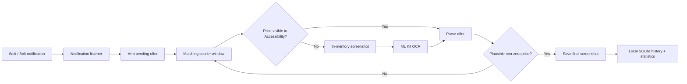

<p align="center">
  
</p>

<p align="center">
  <a href="https://github.com/Bl0ck154/CourierPilot/actions/workflows/ci.yml"></a>
  
  
  
  
</p>

> **Unofficial project.** CourierPilot is not affiliated with, endorsed by, or sponsored by Wolt, Bolt, DoorDash, or any of their affiliates. Product names and trademarks belong to their respective owners.

## Why CourierPilot?

Courier apps show useful information only briefly at offer time. CourierPilot creates a private, searchable record of the offers **you actually saw** so you can inspect prices, routes and patterns later instead of relying on memory.

Capture is deliberately conservative: **an offer is not archived until a plausible non-zero price is visible.** Intermediate OCR probe screenshots stay in memory and are never written to the Gallery.

### What it can record

| | CourierPilot 0.6.0 |
|---|---|
| 💶 Price | Captured only when a real non-zero full-delivery price is detected |
| 📍 Distance | Stored when the courier app exposes it |
| ⏱ Estimated time | Stored when available |
| 🏪 Merchant | One or multiple venues, including stacked offers |
| 🧭 Pickup / drop-off | Structured locally when available |
| 👤 Customer name | Stored locally when available |
| 📦 Stacked offers | Supports multiple merchants **and multiple deliveries from one merchant** |
| 🖼 Original offer | Final priced screenshot saved to `Pictures/CourierOffers` |
| 🕒 Work time | Manual `Start shift` / `End shift` tracking |

Fields that a courier platform does not expose are left empty rather than invented. Bolt, for example, may expose time and price without route distance.

## Highlights

### Automatic priced-offer capture

`NotificationListenerService` detects matching Wolt/Bolt task notifications and arms a capture transaction. `AccessibilityService` watches the matching courier window and parses visible UI text. If the final price is not exposed through Accessibility yet, CourierPilot uses on-device ML Kit OCR as a fallback.

The active transaction is protected from repeated notification updates and stale screenshot/OCR callbacks and can remain pending for up to three minutes while waiting for a price.

### Material 3 dashboard

CourierPilot 0.6.0 moves the main product UI to **Jetpack Compose + Material 3**:

- dark command/shift hero instead of an all-white card wall;
- tonal metric surfaces and clearer visual hierarchy;
- system dark mode;
- safe handling of Android status/navigation insets;
- Material navigation/settings icons;
- finger-friendly horizontally scrollable activity calendar;
- searchable History with `All / Wolt / Bolt / Single / Stacked` filters;
- period-based Statistics with visual platform and stacked splits.

The UI direction and interaction rules are documented in [`docs/DESIGN.md`](docs/DESIGN.md).

### Offer Details

Each captured offer can include:

- platform and arrival time;
- expected full-delivery price;
- route distance and calculated €/km when distance exists;
- estimated time;
- single vs stacked delivery count;
- merchant names and pickup addresses;
- customer names and drop-off addresses;
- original screenshot;
- optional raw Accessibility/OCR text for local parser diagnostics.

### Same-venue stacked Wolt offers

Restaurant count and delivery count are treated as different concepts. If Wolt exposes one merchant but two customer/drop-off stops, CourierPilot records **two deliveries**, even when the heading remains singular `Delivery from`.

When Accessibility/OCR exposes several euro amounts, the parser prioritizes the amount semantically adjacent to `Expected earnings for the full delivery`.

### Statistics that describe offers — not imaginary earnings

CourierPilot can show:

- Today / 7-day / 30-day / all-time summaries;
- Wolt vs Bolt split;
- average offer value;
- average detected distance;
- average €/km where distance exists;
- single vs stacked counts;
- represented delivery stops;
- activity by day and period;
- manually tracked work time.

Work time comes from explicit `Start shift` / `End shift` sessions rather than guessing from first/last offer timestamps.

### Reliability Center

Android background behavior can be aggressive, especially on OEM builds. CourierPilot includes a dedicated Reliability screen with:

- Notification Listener status;
- Accessibility capture status;
- battery-optimization / Doze state;
- Android background restriction state;
- optional courier-app auto-open;
- optional brief wake-screen behavior;
- optional **non-persistent alive reminder** approximately every four hours;
- current pending offer;
- last screenshot / last error;
- privacy-safe bounded capture event log;
- shortcuts to relevant Android settings;
- shareable privacy-safe diagnostics.

The alive reminder is off by default and does not create a permanent foreground notification.

## How capture works



No Wolt/Bolt APK modification is involved. CourierPilot does **not** require root, Shizuku, ADB, Lucky Patcher, or a MediaProjection permission prompt.

## Privacy model

CourierPilot is designed as a local personal tool.

- Offer history is stored in the app's local SQLite database.
- Final offer screenshots are stored in the user's Gallery under `Pictures/CourierOffers`.
- Customer names and addresses are not written to the privacy-safe reliability event log.
- Intermediate OCR probe screenshots are kept in memory only and recycled after recognition.
- The app manifest does **not** request Android's `INTERNET` permission.
- There is no CourierPilot account or cloud sync.

Raw Accessibility/OCR text can contain information visible on the courier screen, so it is kept for local diagnostics and should be treated as private data.

## Installation

CourierPilot currently targets personal/sideloaded Android use.

1. Install a release-signed CourierPilot APK.
2. Open **CourierPilot**.
3. Enable **Notification access** for CourierPilot.
4. Enable **Accessibility → CourierPilot screen capture**.
5. On phones with aggressive background management, review **Settings → Reliability** and allow the app to keep running as needed.

Optional behavior such as auto-open, wake-screen and the periodic alive reminder is configured in Reliability.

> Signed release builds use the permanent CourierPilot signing identity documented in [`docs/RELEASE_SIGNING.md`](docs/RELEASE_SIGNING.md).

## Requirements

- Android 11 / API 30 or newer;
- Wolt Courier Partner and/or Bolt Courier app installed;
- Notification Access permission;
- Accessibility service enabled for offer capture.

## Tech stack

- **Kotlin** / Android SDK;
- **Jetpack Compose + Material 3** for the main dashboard;
- **NotificationListenerService** for incoming courier-task notifications;
- **AccessibilityService** for window-aware UI extraction and screenshot capture;
- **Google Play services ML Kit Text Recognition** for OCR fallback;
- **SQLiteOpenHelper** for local offer and shift history;
- **JUnit + Robolectric** for parser and launcher-start regression tests;
- **GitHub Actions** for CI and permanent-certificate release builds.

Capture/parser/database code remains independent of Compose, and the previous Views dashboard remains in the codebase as a fallback while the new UI is field-tested.

## Build from source

The project uses Java 17 and Android SDK 35.

```bash
gradle testDebugUnitTest assembleDebug
```

Release tasks intentionally fail unless all signing environment variables are present:

```text
ANDROID_KEYSTORE_PATH
ANDROID_KEYSTORE_PASSWORD
ANDROID_KEY_ALIAS
ANDROID_KEY_PASSWORD
```

The repository does not contain the private release keystore. See [`docs/RELEASE_SIGNING.md`](docs/RELEASE_SIGNING.md) for the public signing identity and verification process.

## Current release

**CourierPilot 0.6.0** (`versionCode 10`)

0.6.0 is the Material 3 UI and implementation-audit release. It also retains the 0.5.4 parser fixes for same-venue stacked Wolt offers and full-delivery price selection, stabilizes the optional alive-reminder schedule, reduces unnecessary Accessibility polling, and cleans up a Gallery screenshot if the corresponding database insert fails.

## Known limitations

- Android/OEM background restrictions can still interrupt capture until the relevant system permissions/settings are granted.
- A courier app can block screenshots with secure-window flags.
- Merchant/address parsing is best-effort and may need tuning when Wolt/Bolt change their UI.
- Capture is still serialized around one active offer, with limited queuing/replacement behavior for overlapping notifications.
- Bolt and Wolt expose different fields; missing fields remain empty.
- CourierPilot records **offers shown**, not whether an offer was accepted, completed, cancelled, or ultimately paid.
- The Compose dashboard is new in 0.6.0 and is intentionally being field-tested while the legacy Views implementation remains available in the codebase.

## Contributing

Bug reports and parser samples are useful, especially after courier-app UI changes. When sharing diagnostics publicly, remove or redact customer names, phone numbers, exact addresses and screenshots containing personal information.

For capture problems, the Reliability screen's privacy-safe diagnostics report is preferred over raw order data.

See [`CONTRIBUTING.md`](CONTRIBUTING.md) for contribution guidelines.

---

<p align="center">
  Built for real-world courier use — local data, inspectable behavior, and no invented metrics.
</p>
