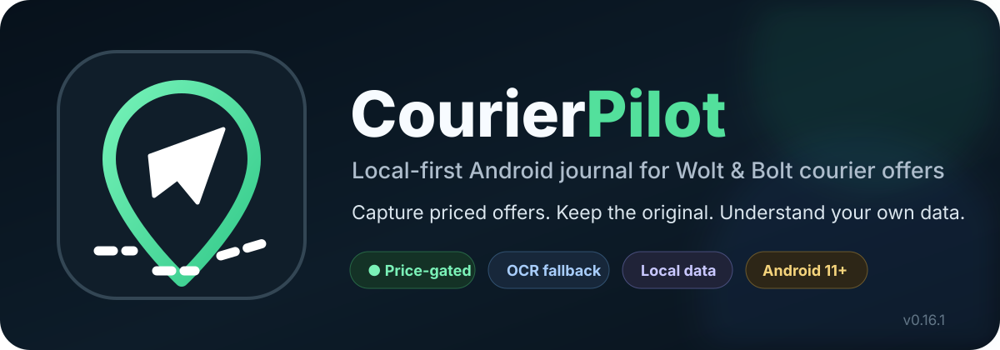
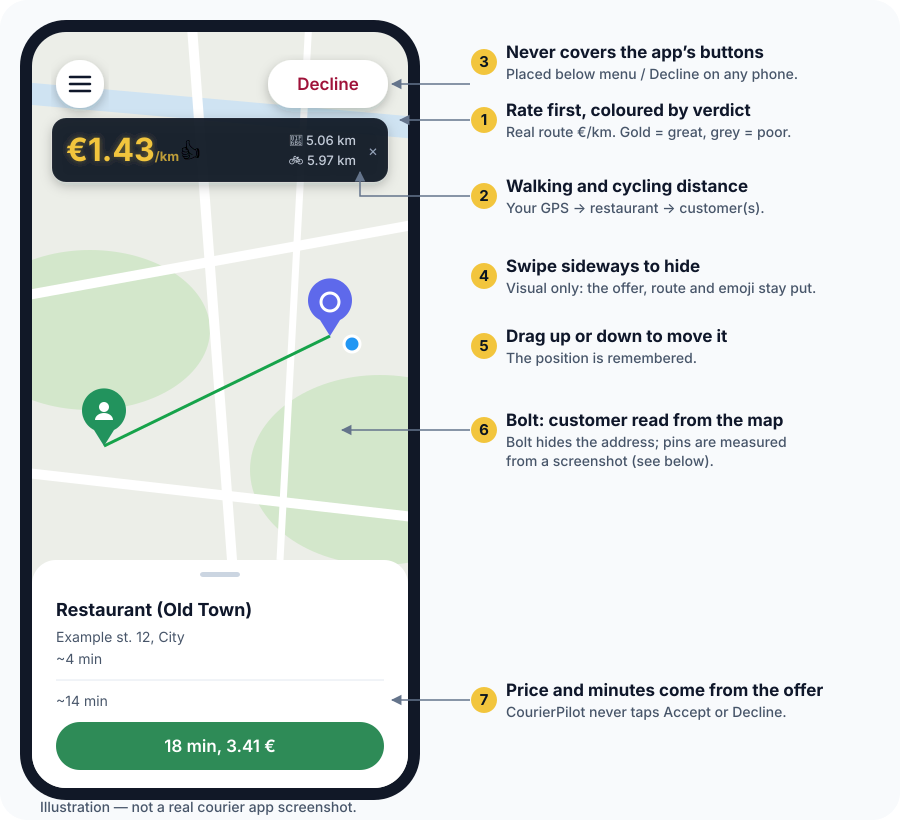
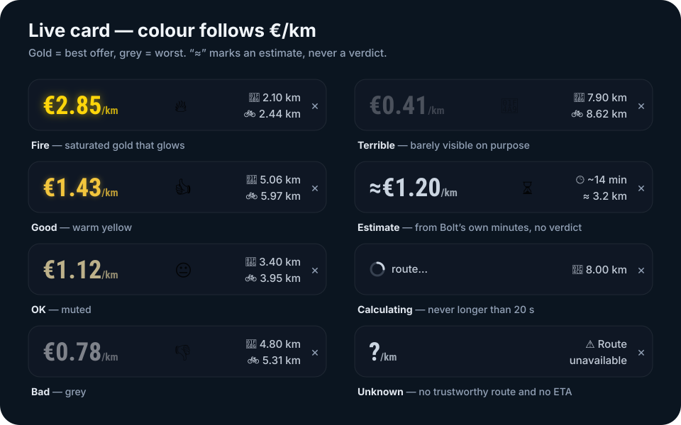
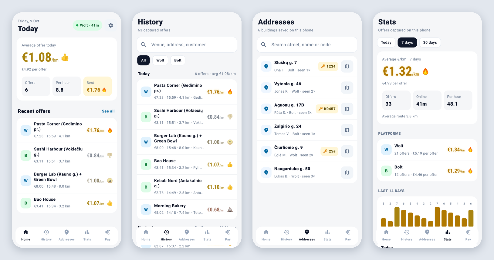
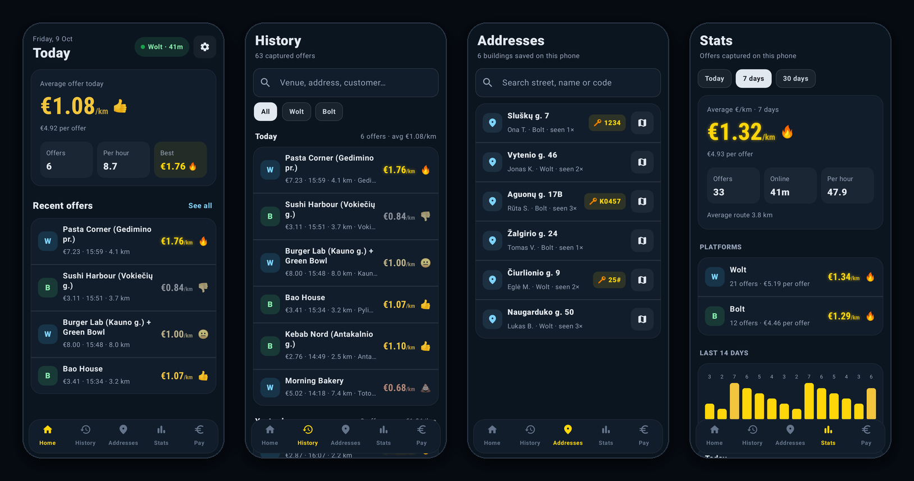
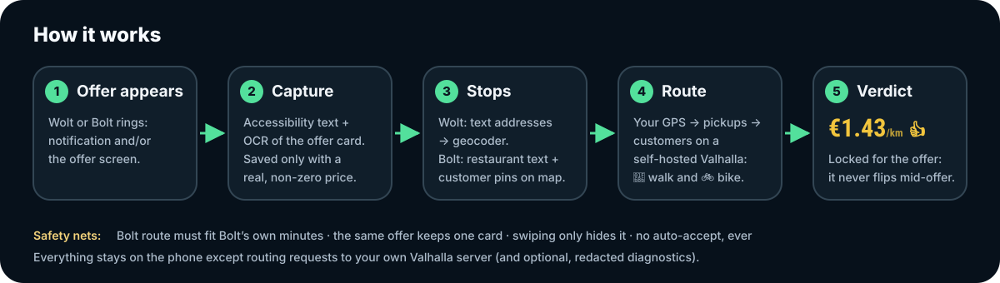
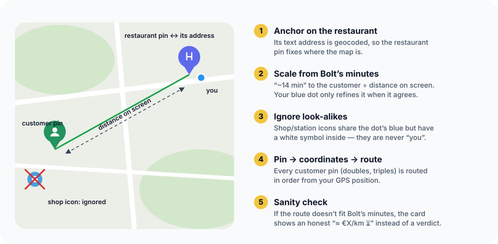

<p align="center">
  
</p>

<p align="center">
  <a href="https://github.com/Bl0ck154/CourierPilot/actions/workflows/ci.yml"></a>
  
  
  
</p>

> **Unofficial project.** CourierPilot is not affiliated with, endorsed by, or sponsored by Wolt, Bolt, or their affiliates.

## What it is

CourierPilot is a local-first Android companion for Wolt and Bolt couriers. When an offer rings, it reads the offer from the screen, works out the **real route** you would ride, and shows one number in a small floating card: **money per real kilometre**, coloured by how good the offer is.

It never taps Accept or Decline for you. It also keeps a private history of every priced offer, the addresses you visit and your platform presence, so you can understand your own work from your own data.

<p align="center">
  
</p>

## The live card

The card appears while the offer is on screen and disappears when the offer ends (accepted, declined, expired or replaced).

- **Rate first.** `€1.43/km` is the price divided by the real route distance, not by the platform's advertised kilometres.
- **Colour = verdict.** The best offers glow in saturated gold; worse offers fade towards grey until a terrible one is barely visible. The emoji fades with it.
- **Route on the right.** 🚶 walking and 🚲 cycling distance from your GPS position via every pickup to every customer.
- **`≈` means estimate.** When a full route cannot be trusted, the card says so (`≈ €X/km ⏳` or `?/km`) instead of pretending.
- **One offer, one verdict.** The number and emoji are locked once shown; they never flip while you decide.
- **Swipe sideways** to hide the card for this offer (purely visual). **Drag up or down** to move it; the position is remembered.
- **Never covers the app's buttons.** The card is placed below the courier app's menu and Decline buttons on any screen size.

<p align="center">
  
</p>

## The app

Home, History and Addresses are grouped lists that reuse the live card's colours: every offer's €/km is graded from gold (🔥) to clay (💩), venues of stacked orders are shown together (`Burger Lab + Green Bowl`), and saved door codes sit right next to the address. Light, dark or follow the phone — your choice in **Settings → Appearance**; the live card itself always stays dark so it reads over any map.

<p align="center">
  <picture>
    <source media="(prefers-color-scheme: dark)" srcset="docs/assets/app-screens-dark.png" />
    
  </picture>
</p>

<p align="center"><sub>Rendered from the real app with invented venues, customers and codes.</sub></p>

<details>
<summary>Dark theme</summary>
<p align="center">
  
</p>
</details>

## How it works

<p align="center">
  
</p>

1. **Offer appears.** A Wolt or Bolt notification and/or the offer screen is detected.
2. **Capture.** Accessibility text plus OCR of the offer card. An offer is saved only once a plausible, non-zero price is visible, and the clean proof screenshot is stored before any card is drawn.
3. **Stops.** Wolt exposes text addresses, which are geocoded. Bolt shows only the restaurant address; customers are pins on a map (see below).
4. **Route.** A fresh GPS fix plus the ordered stops go to a protected **self-hosted Valhalla** server for walking and cycling routes.
5. **Verdict.** Money per real kilometre is scored against your local market thresholds and shown as colour and emoji.

### Bolt: reading customers from the map

Bolt does not show the customer address before you accept, only a map. CourierPilot measures the pins in a screenshot of the offer:

<p align="center">
  
</p>

- The **restaurant pin** is matched to its geocoded text address; that fixes where the map is.
- The **scale** comes from Bolt's own minutes to the customer. Your blue location dot only refines it when it agrees, because shop and station icons share its colour.
- Every **customer pin** (doubles, triples, several restaurants) becomes a coordinate and is routed in order.
- A final **sanity check** compares the route with Bolt's minutes. If they don't fit, the card shows an honest `≈ €X/km ⏳` estimate instead of a verdict.

In developer mode the card also shows tiny debug lines (the pickup address and the recovered customer address), and accepted Bolt orders are compared with the real address Bolt reveals, so recovery accuracy is measured rather than guessed.

## Features

| | |
|---|---|
| 💶 **Offer history** | Every priced offer with its proof screenshot, stored on the phone |
| 🎯 **Live card** | Real-route €/km, colour-graded verdict, walking and cycling distance |
| 🧭 **Wolt routing** | Timeline stop order (including stacked orders) → geocoder → Valhalla |
| 🗺 **Bolt map recovery** | Customer pins from the offer map, ETA-anchored scale and sanity gate |
| 📈 **Adaptive thresholds** | Verdict bands learned from your own local market history |
| 🔐 **Access codes** | Remembers door codes and arrival hints per address |
| 🛰 **Ride traces** | Explicit GPS recording of real rides for future personal route learning |
| 🔊 **Voice** | Optional spoken offer summary, off by default |
| 🌗 **Light & dark** | System, Light or Dark theme; the live card always stays dark |
| 🩺 **Reliability screen** | Privacy-safe capture diagnostics and an exportable report |

## Local data and privacy

- `courier_offers.db` — priced offer history;
- `courier_meta.db` — platform presence, address visits/context and access-code memory;
- `route_research.db` — route provenance, Bolt recovery accuracy, lifecycle research and GPS ride traces;
- `Pictures/CourierOffers` — priced proof screenshots.

Stops are resolved by the device geocoder and the ordered coordinates are sent only to your own protected Valhalla server. There is no CourierPilot account, cloud sync or `ACCESS_BACKGROUND_LOCATION`.

Raw offer text, exact addresses, GPS points and Bolt samples stay out of the privacy-safe Reliability diagnostics. The on-card debug lines are on-screen only and are never logged.

**Remote diagnostics are optional and off by default.** When enabled in Reliability, only bounded technical metadata is uploaded (random install/session IDs, app/device version, platform, stage and a sanitized message) to the project's self-hosted endpoint. Notification text is redacted; screenshots, OCR frames, customer names, exact addresses and GPS coordinates are never included.

## Installation

1. Install a release-signed CourierPilot APK (built automatically for every release tag).
2. Enable **Notification access**.
3. Enable **Accessibility → CourierPilot screen capture**.
4. Grant foreground location for routing and ride traces.
5. In the app, enable Wolt and/or Bolt routing and set your Valhalla endpoint.
6. Optional: turn on **Developer mode** to see the debug lines on the card.

## Build

```bash
gradle testDebugUnitTest assembleDebug
```

Android 11+ · Kotlin · Android SDK 35 · Java 17 · Jetpack Compose / Material 3 · NotificationListenerService · AccessibilityService · ML Kit Text Recognition · self-hosted Valhalla · SQLite · JUnit/Robolectric · GitHub Actions.

Release signing is documented in [`docs/RELEASE_SIGNING.md`](docs/RELEASE_SIGNING.md). Contributions: see [`CONTRIBUTING.md`](CONTRIBUTING.md) and never attach unredacted courier screenshots.

## Releases and roadmap

- **0.17.1** — instant History with incremental loading, redesigned Stats, Pay and Settings. See [`docs/RELEASE_0.17.1.md`](docs/RELEASE_0.17.1.md).
- **0.17.0** — new grouped-list design for Home/History/Addresses, System/Light/Dark theme, every venue of stacked Wolt orders. See [`docs/RELEASE_0.17.0.md`](docs/RELEASE_0.17.0.md).
- **0.16.2** — full Bolt venue names, new Wolt "Deliver to" screen, door-code reminders. See [`docs/RELEASE_0.16.2.md`](docs/RELEASE_0.16.2.md).
- **0.16.1** — live card redesign (gold → grey), Bolt map anchoring fix, ETA sanity gate, no card restarts while an offer rings. See [`docs/RELEASE_0.16.1.md`](docs/RELEASE_0.16.1.md).
- **0.16.0** — live advisor overhaul: stable sessions, compact card, flicker-free capture, Bolt north-up recovery. See [`docs/RELEASE_0.16.0.md`](docs/RELEASE_0.16.0.md).
- **Next** — map-label registration for Bolt (OCR of street and place names as extra anchors) and line-graph pairing for multi-stop orders, gated on measured accuracy. See [`docs/LIVE_ADVISOR_OVERHAUL_PLAN.md`](docs/LIVE_ADVISOR_OVERHAUL_PLAN.md) and [`docs/ROUTE_INTELLIGENCE_ROADMAP.md`](docs/ROUTE_INTELLIGENCE_ROADMAP.md).

---

<p align="center">Built for real courier use: inspectable numbers, explicit provenance, no invented certainty.</p>
